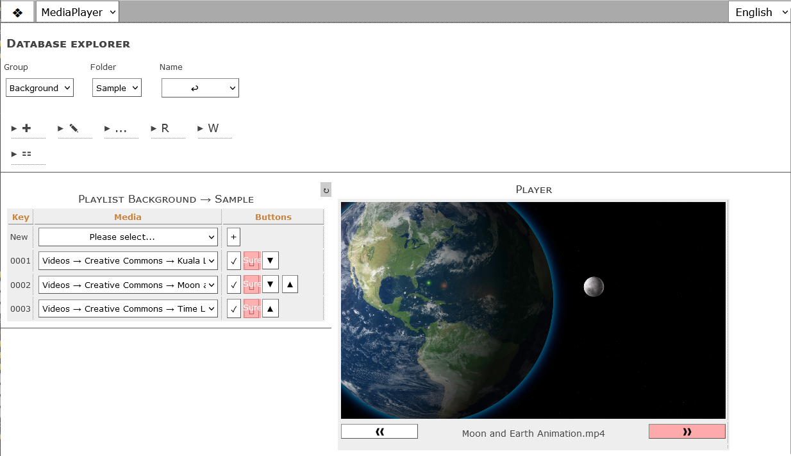

# MediaPlayer
MediaPlayer is an App for Datapool which adds a video playlist feature to the web application. The App is added as a web page within the category *Apps*. It employs the Datapool App interface and the motivation was to use this App as a test case for the App interface.
## The user interface (web page)

## How to use it?
Datapool stores videos as well as other media as entries in the database table *multimedia*. The video files themself are stored in the *filespace* folder. Any video from *multimedia* can be linked to MediaPlayer playlists.

Playlists are organised within Groups and Folders. Technically a playlist is a collection of entries within the same Group and Folder with each playlist entry pointing to a video entry.

Everything at Datapool is based on entries (multi-dimensional arrays) with a common structure of first level array keys Source, Group, Folder, Name, EntryId etc.
The value of entry\[\'Source\'\] is equivalent to the database table, the other keys are equivalent to the database columns.
