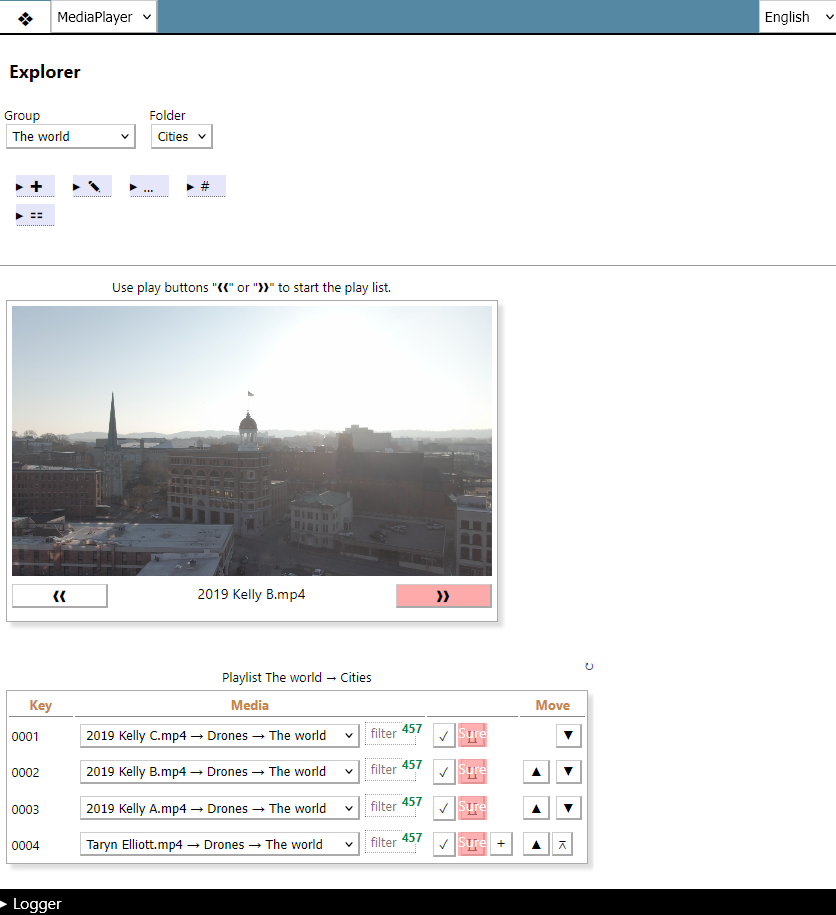

# MediaPlayer
MediaPlayer is an App which adds a video playlist feature to the Datapool web application.
The App is added as a web page within the category *Apps*. It employs the Datapool App interface and the motivation was to use this App as a test case for the App interface.

## The user interface (web page)
The player runs all videos of the playlist in a loop in descending or ascending order.
The direction is selected through the play buttons below the player left and right.

The new video will be loaded into the player when the previous video is finished. 

## How to use it?
Datapool stores videos as well as other media as entries in the database table *multimedia*.
The video files themself are stored in the *filespace* folder.
Any video from *multimedia* can be linked to a MediaPlayer playlist entry.
The available videos are displayed in a list from which they can be selected.

Playlists are organised within Groups and Folders.
Technically a playlist is a collection of entries within the same Group and Folder with each playlist entry pointing to a video entry.

Everything at Datapool is based on entries (multi-dimensional arrays) with a common structure of first level array keys Source, Group, Folder, Name, EntryId etc.
The value of entry\[\'Source\'\] is equivalent to the database table, the other keys are equivalent to the database columns.

## Background information
The class MediaPlayer.php will be instantiated by Datappol\'s Root.php.
Using the Datapool web application, when MediaPlayer is selected Root.php will call the *run* method of *SourcePot\MediaPlayer\MediaPlayer*.
The run method creates the html code enveloped by the web page\'s main-tags.
The file content of the MediaPlayer.js and MediaPlayer.css files is loaded into the webpage as inline css and js code.
This is necessary because these files are not located in the www-directory.